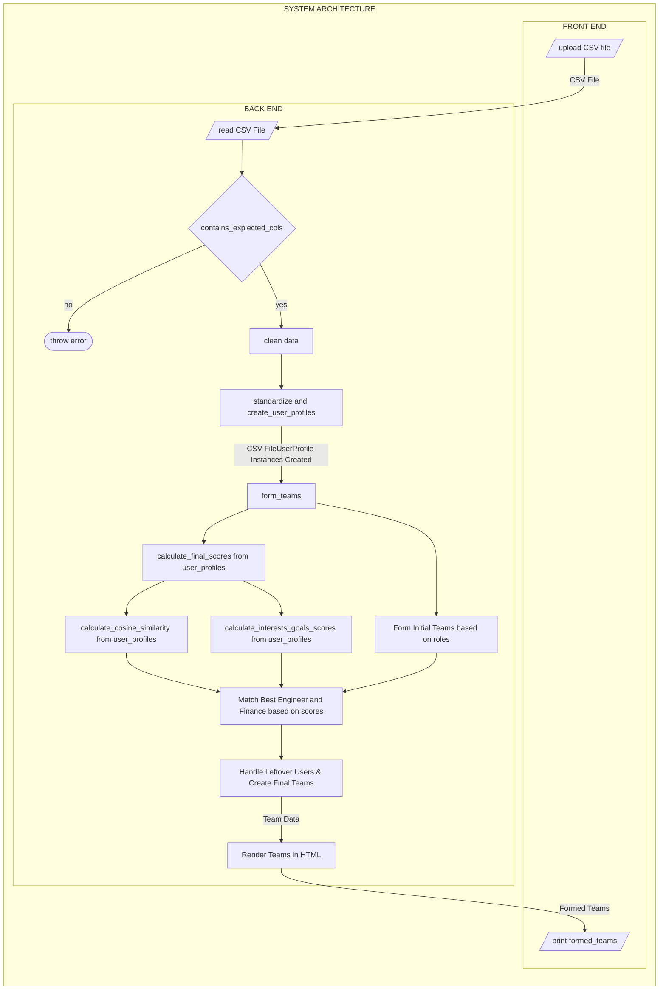

<h1 align="center">Matching Engine</h1>

The matching engine is built to match students with each other &amp; ideas!

This matching engine streamlines the formation of three-person student teams, optimizing for collaboration and project success. It processes student data from a CSV file, incorporating information such as interests, project ideas, and goals. By leveraging cosine similarity calculations, the engine identifies students with closely related intellectual pursuits while ensuring a balanced distribution of technical, financial, and other essential skills critical for scaling up team productivity.

The program computes cosine similarity scores to analyze domains of Interest, majors, project ideas, and participation goals. This approach guarantees that each team is strategically composed of members with expertise from different domains at most.

# Installation

To clone the app, run in the terminal:

```bash
git clone https://github.com/ac-i2i-engineering/matching-engine.git
cd matching-engine
```

Set up a virtual environment and activate it to "containerize" the dependencies:

```bash
python3 -m venv env
source env/bin/activate
```

To run the app locally, run:

```bash
pip install -r requirements.txt
cd matching_backend
python manage.py makemigrations
python manage.py migrate
python manage.py runserver
```

# System Architecture



# Expected Input CSV data format
|Timestamp|Email Address|Full Name|Class Year|Major|Additional Major 1|Additional Major 2|Domains of Interest|Do you have an idea(big or small)?|What is your idea?|What stage are you at?|What role are you interested in taking on a team?|Has your team been registered?|If your team has not registered enter your email below and we will send you the form|
| --- | --- | --- | --- | --- | --- | --- | --- | --- | --- | --- | --- | --- | --- |
|     |     |     |     |     |     |     |     |     |     |     |     |     |     |

# CI/CD Testing & Deployment Pipeline

We use modularized `pytest-django`-based unit-tests and `GitHub Actions` to test our backend ("business") logic in an end-to-end CI/CD environment. We also run custom regression-tests and deployment/integration-tests through a combination of technologies like [Railway](https://railway.app/), [Vercel](https://vercel.com/) & `npm`. This is to have health-checks on the system & give our developers extensive experience in technologies that they most-likely will encounter in industry settings.


# Demo & screenshots: (Last updated 10th Sept, 2024)

- **Youtube Demo link:** https://youtu.be/oAPVXGaYS8Q


